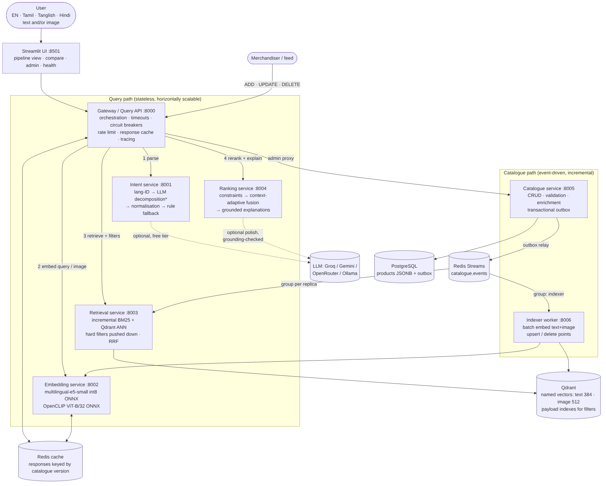
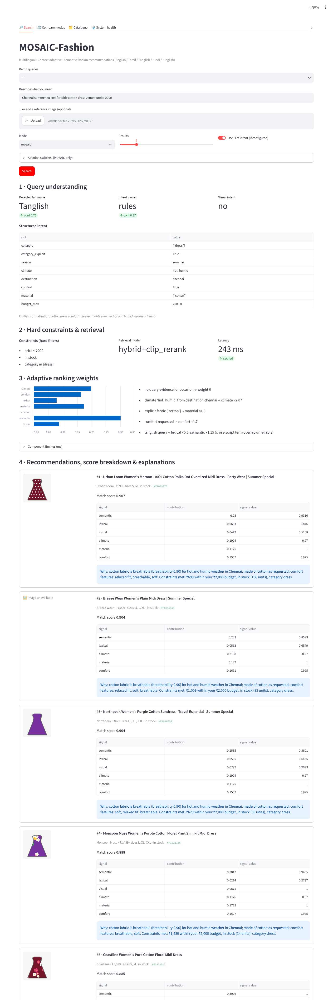
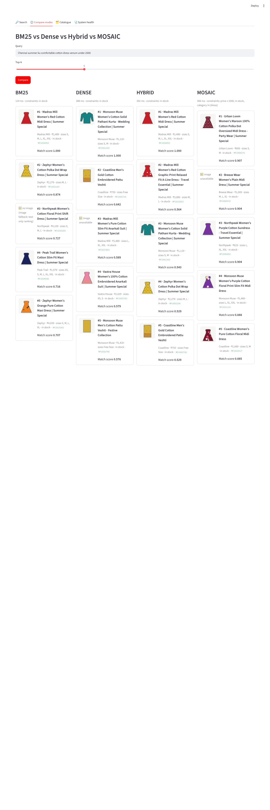

# MOSAIC-Fashion
**M**ultilingual **O**ccasion- and **S**eason-**A**ware **I**ntent-**C**onditioned fashion recommendation.

A production-oriented microservice system for semantic fashion search. You can ask the way you would ask a shop assistant,
in **English, Tamil, Tanglish (Tamil-English code-mix), Hindi or Hinglish**, with text and/or a reference image:

> `Chennai summer ku comfortable cotton dress venum under 2000`
> `கல்யாணத்துக்கு சிவப்பு பட்டு புடவை` · `शादी के लिए लाल लहंगा 15000 से कम` · `I need an outfit to go to the beach this summer`

It returns products **only from the catalogue**. Each result comes with its match score, per-signal score breakdown, the
query-dependent weights (with the reasons for them), the hard constraints it satisfies, and a grounded explanation.



## What's inside
| capability | how |
|---|---|
| Multilingual NLU | script + code-mix language ID → optional **free** LLM decomposition (Groq / Gemini / OpenRouter / Ollama) → normalisation onto a canonical vocabulary → deterministic multilingual rule parser (fallback, and always used for numbers) |
| Structured intent | category, occasion, season, climate (destination-aware: Chennai→hot-humid, Manali→cold, Delhi depends on season), comfort, style, material, colour, pattern, budget, size, gender, destination, sustainability |
| Retrieval | multilingual **e5** dense (Qdrant HNSW) + incremental **BM25** + **RRF** hybrid; hard filters pushed into both channels |
| Multimodal | OpenCLIP ViT-B/32 image vectors per product; text→image and image→image similarity; query-by-image |
| **Contribution: context-adaptive ranking** | 7 signals (semantic, lexical, visual, occasion, climate, material, comfort). Weights are a **function of the decomposed intent**: e.g. image query → visual ×3.5; Chennai+summer+cotton+comfort → climate ×2.07, material ×1.8, comfort ×1.7; code-mixed query → lexical ×0.6. Signals with no evidence are switched off, and a missing image is renormalised per item |
| Hard constraints | price, stock, size, explicit category and gender are **filters**, not similarity |
| Grounded LLM use | LLM only decomposes intent and (optionally) polishes explanations. It never sees or picks products. Polished text is rejected if it adds any number or attribute not in the product facts |
| Evolving catalogue | ADD / UPDATE / DELETE → Postgres + **transactional outbox** → Redis Streams → incremental Qdrant upserts and BM25 deltas. **No rebuilds.** Measured time-to-searchable ≈ **0.2 s** (lexical) / **0.25 s** (dense) |
| Reliability | health/readiness on every service, structured JSON logs with request IDs, Prometheus metrics, timeouts/retries/circuit breakers, explicit degraded modes (LLM→rules, vector→BM25, image→text, ranking→retrieval order), validation, admin key, `.env` config |
| Evaluation | 120 multilingual queries; BM25 / Dense / Hybrid / MOSAIC + 6 ablations; P@5/10, R@10, NDCG@10, MRR, MAP, HitRate, constraint satisfaction; significance tests; load, scale and fault-injection tests |

Everything is **free and open-source**: models (MIT), Qdrant, PostgreSQL, Redis, FastAPI, Streamlit, ONNX Runtime. No paid API is needed.

## Quick start
**Windows, no Docker:** install Python 3.12, then double-click `setup_windows.bat` once and `start_windows.bat`. See [docs/WINDOWS.md](docs/WINDOWS.md). Any OS without Docker: `python scripts/launcher.py setup` then `python scripts/launcher.py start`.

With Docker:
```bash
./scripts/download_models.sh                         # free models (e5 int8 ONNX, OpenCLIP → ONNX)
python3 -m venv .venv && .venv/bin/pip install -r requirements-dev.txt
PYTHONPATH=libs:. .venv/bin/python -m ingestion.synthetic_catalogue --n 5000 --out data --render
cp .env.example .env
docker compose up -d --build && docker compose run --rm seed
# UI → http://localhost:8501     API → http://localhost:8000/docs
```
Native run, real Amazon Reviews 2023 data, free LLM setup and every env var: **[docs/RUNNING.md](docs/RUNNING.md)**.

## Results (measured, 5K-product catalogue, 120 queries; full tables in `evaluation/reports/`)
| System | P@10 | R@10 | NDCG@10 | MRR | MAP@10 | ConstraintSat@10 |
|---|---|---|---|---|---|---|
| BM25 | 0.346 | 0.047 | 0.306 | 0.395 | 0.309 | 0.361 |
| Dense (e5) | 0.378 | 0.045 | 0.331 | 0.553 | 0.298 | 0.438 |
| Hybrid (RRF) | 0.471 | 0.059 | 0.412 | 0.588 | 0.397 | 0.521 |
| Hybrid + intent filters | 0.932 | 0.167 | 0.840 | 0.971 | 0.917 | 0.983 |
| **MOSAIC** | **0.954** | **0.174** | **0.916** | 0.968 | **0.943** | 0.983 |

NDCG@10 per language (MOSAIC / Hybrid): en 0.947 / 0.677 · ta 0.877 / 0.209 · tanglish 0.943 / 0.473 · hi 0.896 / 0.288.
Ablations (ΔNDCG@10 vs full MOSAIC, all p ≤ 0.0002): fixed weights −0.013, no image −0.022, dense-only candidates −0.014,
no context signals −0.086, no intent decomposition −0.532.
Latency (2 vCPU, everything co-located): MOSAIC P50 81 ms / P95 111 ms with 1 user; it saturates at about 22 req/s with 0 errors.

**Scale (live catalogue grown through the ADD path, measured at each size):**

| products | MOSAIC NDCG@10 | MOSAIC P50 / P95 (ms) | time-to-searchable lexical / dense | ingest rate |
|---|---|---|---|---|
| 5K | 0.916 | 77 / 109 | 0.20 s / 0.25 s | ≈46 /s |
| 20K | 0.921 | 109 / 135 | 0.26 s / 0.32 s | 42 /s |
| 50K | 0.948 | 132 / 176 | 0.30 s / 0.19 s | 39 /s |
| 100K | 0.951 | 176 / 248 | 0.54 s / 0.40 s | 27 /s |

**Resilience drills** (kill intent / embedding / Qdrant / ranking, unreachable LLM, broken image): every query still got
results with 0 HTTP errors and an explicit `degraded` flag, and recovered after restore (`evaluation/reports/fault_injection.md`).
**Caveat:** relevance is judged on a synthetic catalogue (same schema as Amazon-2023), because HuggingFace was not
reachable from the build sandbox. Read [docs/EVALUATION.md](docs/EVALUATION.md) for validity caveats and failure analysis.

## Repository map
```
libs/mosaic_common/   shared: config, schemas (API contracts), fashion knowledge base (multilingual lexicons, climate & material model,
                      product enrichment), filters, Qdrant wrapper, event bus, resilient HTTP client, service factory, logging
services/
  gateway/            public API + orchestration + fallbacks + cache + catalogue proxy + time-to-searchable
  intent/             language ID, rule parser, LLM client (free providers), normaliser/merger
  embedding/          ONNX e5 + CLIP encoders (torch-free; CLIP BPE ported), caches, image loading
  retrieval/          incremental BM25, hybrid RRF, signal completion, stream consumer
  ranking/            signals, context-adaptive weights, grounded explanations
  catalogue/          Postgres CRUD + transactional outbox relay
  indexer/            event-driven incremental vector indexing
ui/streamlit_app.py   pipeline view · mode comparison · catalogue admin · health
ingestion/            synthetic Amazon-2023-schema generator, image renderer, Amazon adapter, image downloader, bulk loader
evaluation/           query set, judge, metrics, offline eval + ablations, load test, scale test, fault injection, reports/
tests/                unit (no stack) + integration (live stack) tests
docker/, docker-compose.yml, Makefile, scripts/   deployment & ops
docs/                 ARCHITECTURE · DESIGN_DECISIONS · EVALUATION · SCALING · RUNNING · diagrams/
```

## Screenshots
| pipeline view (Tanglish query) | BM25 / Dense / Hybrid / MOSAIC comparison |
|---|---|
|  |  |

## Docs
* [Architecture](docs/ARCHITECTURE.md): components, query and catalogue flows, signals, contracts
* [Design decisions](docs/DESIGN_DECISIONS.md): why each choice, trade-offs, what would change it
* [Evaluation](docs/EVALUATION.md): methodology, results, ablations, failure analysis, caveats
* [Scaling](docs/SCALING.md): measured 5K→100K, plan for millions
* [Running](docs/RUNNING.md): Docker / native, Amazon data, free LLMs, env vars, API examples
* [Limitations](docs/LIMITATIONS.md): what is not done or not verified, and the next steps
