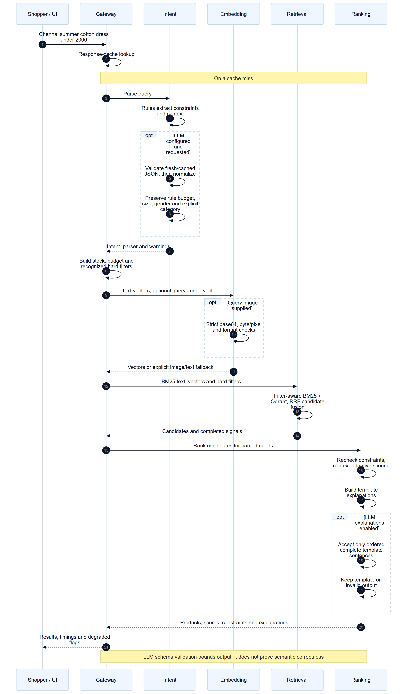
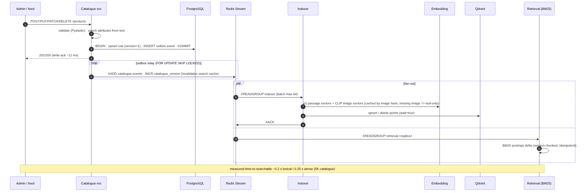

# Architecture

Sources: `docs/diagrams/*.mmd` (Mermaid) → rendered `*.svg` / `*.png`.

## Components
| service | port | responsibility | key code |
|---|---|---|---|
| **gateway** | 8000 | public API; orchestrates the query path; per-hop timeouts, retries, circuit breakers; degraded-mode fallbacks; Redis response cache keyed by catalogue version; rate limiting; catalogue admin proxy; time-to-searchable probe; `/system/status` | `services/gateway/app.py` |
| **intent** | 8001 | language ID (Tamil/Devanagari script + Tanglish/Hinglish markers); optional LLM JSON decomposition (free providers); normalisation onto canonical vocabulary; deterministic multilingual rule parser (fallback + numeric slots) | `services/intent/*` |
| **embedding** | 8002 | multilingual-e5-small (int8 ONNX) query/passage vectors; OpenCLIP ViT-B/32 text & image vectors (ONNX; BPE tokenizer ported, torch-free); Redis cache for query vectors and image vectors (by content hash); image loading with fallback | `services/embedding/*` |
| **retrieval** | 8003 | incremental in-memory BM25 (kept fresh from the event stream) + Qdrant ANN (text and image named vectors) with hard filters pushed down; RRF fusion; full signal completion per candidate; BM25-only fallback | `services/retrieval/*`, `libs/mosaic_common/vector_store.py` |
| **ranking** | 8004 | constraint re-check; 7 signals; context-adaptive weights + rationale; per-item renormalisation; template explanations with optional LLM selection of approved sentences; baseline orderings with the same contract | `services/ranking/*` |
| **catalogue** | 8005 | PostgreSQL system of record (JSONB); validation; attribute enrichment; ADD / UPDATE (PUT/PATCH) / DELETE; bulk; transactional outbox + relay to Redis Streams; keyset export | `services/catalogue/app.py` |
| **indexer** | 8006 | consumes catalogue events in batches; embeds text + image; upserts/deletes Qdrant points; records `indexed_at` | `services/indexer/worker.py` |
| **ui** | 8501 | Streamlit: pipeline view, BM25/Dense/Hybrid/MOSAIC comparison, catalogue admin + time-to-searchable, health & reports | `ui/streamlit_app.py` |

Infrastructure: **PostgreSQL 16** (catalogue + outbox), **Redis 7** (cache + Streams event bus), **Qdrant** (vectors + filterable payload).
Optional: Prometheus (`docker compose --profile monitoring up`).

## Query path

## Catalogue path (ADD / UPDATE / DELETE, incremental)

## Ranking signals
| signal | source | applicable when |
|---|---|---|
| semantic | e5 cosine(query ⊕ English rewrite, product passage) | always |
| lexical | BM25 over title (×2) + features + description + details | always |
| visual | CLIP cosine(text prompt or query image, product image), fused 60/40 with catalogue colour/pattern agreement when colours/patterns are requested; attribute-only if image missing | image signal enabled & evidence |
| occasion | product occasions vs requested (with cross-occasion compatibility, e.g. festive≈wedding 0.6) | occasion requested |
| climate | material breathability / warmth / rain suitability + garment type + season cues vs resolved climate | destination / season / weather words |
| material | explicit fabric match (family-aware) / sustainability / climate-implied fabric | fabric, eco or hot/cold climate |
| comfort | material comfort + comfort features (relaxed fit, stretch, cushioned, breathable…) | comfort words or lounge/travel/sports |

## Hard constraints
`price_min/max`, `in_stock`, `size` (Free Size always passes), explicit `category`, explicit `gender` (unisex always passes).
Applied (1) inside Qdrant as payload filters, (2) in BM25 before top-k, (3) re-checked in ranking. A category is only a
hard constraint when the user names one ("dress"); "an outfit for the beach" keeps all categories open.

## Contracts
All inter-service payloads are Pydantic models in `libs/mosaic_common/schemas.py`. OpenAPI docs: `http://localhost:<port>/docs`.

## Security boundaries

The intent service validates fresh and cached model outputs with the strict, bounded
`LLMIntent` contract in `services/intent/output_security.py` before normalisation.
Invalid output falls back to rules. In the merge, budget, size and gender remain
rule-derived, and an explicit rule category cannot be expanded by the LLM. Inferred
LLM categories remain soft signals when rules found no explicit category.

The embedding service applies `services/embedding/image_security.py` to product
images and uploaded query images. Remote references require an exact approved
HTTPS hostname on port 443. All DNS answers must be public, and the connection is
pinned to a validated IP while preserving the original TLS hostname. Redirects and
compressed HTTP responses are rejected. Local paths must resolve inside
`IMAGE_ROOT`; byte and pixel limits apply before image inference. Failed images
use the existing text-only fallback.

The ranking service creates the template first. If LLM explanations are enabled,
the model may select complete template sentences in their original order. The
validator uses only that template as evidence, not the user's requested attributes
or raw catalogue text. Invalid selections retain the template. This is the current
meaning of the optional explanation step in the high-level diagrams.

These controls do not authenticate catalogue metadata, correct parser mistakes or
guarantee immunity to prompt injection in soft ranking signals. See
[Security](SECURITY.md) for scope and [Running](RUNNING.md) for configuration.
