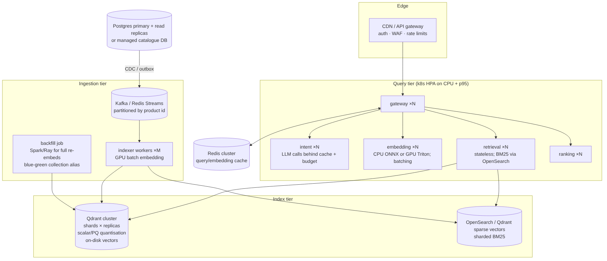

# Scaling MOSAIC-Fashion: 5K → 100K (measured) → millions (design)

## What was actually measured
The measurements below predate security commit `29901c6` (5 October 2026). Scale,
ingestion and latency tables describe the historical multi-size run. That 5K–100K
scale protocol has not been repeated with the safeguards. A new 5K-product
[native rules/Groq evaluation](LLM_STACK_EVALUATION.md) measures relevance and
short load behavior separately; it does not validate larger sizes.

`evaluation/scale_test.py` grows the **live** catalogue through the normal ADD path and measures ingestion rate,
time-to-searchable, latency, relevance and memory at each size. Results: `evaluation/reports/scale_test.md`.
Host: 2 vCPU / 7 GB RAM with all 7 services + Postgres + Redis + Qdrant co-located, so absolute throughput is
CPU-bound by design of the test environment, not by the architecture. Sizes not listed there were not run;
nothing is extrapolated.

## Where the time goes today (see load-test component timings)
| component | share of a MOSAIC request (5K, 1 user) | scaling behaviour |
|---|---|---|
| Qdrant ANN (filtered HNSW, 100 candidates, payload + vectors) | largest | ~log N with HNSW; filter selectivity matters |
| BM25 (in-process, Python) | small at 5K, grows ~linearly with posting-list length | replace with OpenSearch / Qdrant sparse at ≥1M |
| intent (rules) | ~2–10 ms | O(query); LLM path adds 200–800 ms → cache by normalised query |
| embedding (query) | ~7–15 ms (Redis-cached for repeats) | CPU-bound; batch / GPU |
| ranking + explanations | ~8 ms for 100 candidates | O(candidates) — independent of catalogue size |

## Path to millions of products
1. **Vector index**: Qdrant cluster with sharding (by hash of product id) and replication factor 2;
   scalar int8 quantisation (4× memory cut) with rescoring, `on_disk` original vectors; HNSW `m=16, ef_construct=128`
   kept, `hnsw_ef` tuned per p95 budget. At 10M × (384+512) dims ≈ 36 GB fp32 → ≈ 9 GB int8 in RAM.
   Payload indexes on price/stock/size/category/gender keep filtered search fast (already in place).
2. **Lexical index**: move BM25 out of process to OpenSearch (or Qdrant sparse vectors / SPLADE) with the same
   accept-filters; the retrieval service then becomes fully stateless (no warm-up, instant horizontal scaling).
3. **Ingestion**: replace Redis Streams with Kafka partitioned by product id (ordering per product, parallel
   consumers); indexer workers scale horizontally; GPU batch embedding (Triton/ONNX-CUDA) for ~2–5k items/s per GPU.
   Full re-embeddings (model upgrades) run as a Ray/Spark backfill into a **new collection** and switch via a Qdrant
   alias (blue/green, zero downtime, instant rollback). Embedding version is already fingerprinted per model directory.
4. **Images**: CDN-fetched once at ingest, embedded asynchronously; the content-hash cache (already implemented)
   deduplicates variants; image vectors optional per point so text-only products are still searchable.
5. **Query tier**: all query services are stateless → Kubernetes HPA on CPU and p95 latency. Response cache
   (Redis cluster) keyed by normalised intent + catalogue version; query-embedding cache already in place.
   LLM calls bounded by a per-request timeout, cached per normalised query, and budget-limited; the rule parser is the
   always-on fallback, so LLM provider outages never take search down.
6. **Catalogue DB**: Postgres primary + read replicas (or managed); outbox table partitioned by day and pruned.
7. **Ranking evolution**: log impressions/clicks/add-to-cart with the full signal vector (already returned per item)
   → train LTR (LambdaMART) offline → serve as a drop-in replacement for the weight function; A/B behind the gateway.
8. **Multi-region**: read path replicated per region (Qdrant + OpenSearch replicas), single write region for the
   catalogue with event replication.

## Capacity rules of thumb (to validate with the scale test on target hardware)
* ANN memory ≈ N × (384 + 512) × 4 bytes (+ HNSW graph ≈ N × m × 2 × 4 bytes) — quantise beyond ~5M.
* Ranking cost is O(candidate pool), not O(catalogue): keep pool at 100–200.
* Index freshness is bounded by indexer throughput; measure lag (`mosaic_indexer_stream_lag`) and scale workers when
  lag × (1 / throughput) exceeds the freshness SLO.
